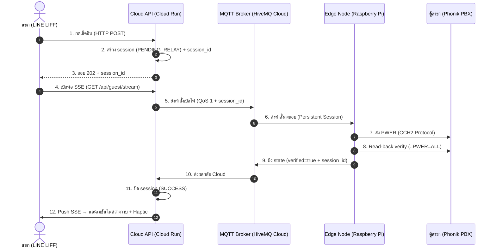

# สะพานเชื่อมต่อ Cloud-to-Edge แบบเรียลไทม์ (MQTT & SSE Real-time Bridge)

เอกสารฉบับนี้สรุปสถาปัตยกรรมการขับเคลื่อนคำสั่งแบบเรียลไทม์ของระบบ **Smart Hotel Self Check-in (SHC)**
ซึ่งยกระดับจากระบบต้นแบบ 5-Core สู่สถาปัตยกรรม **Cloud-to-Edge Bridge** ที่เสถียร ปลอดภัย และตรวจสอบสถานะได้ด้วยตัวเอง (Self-Healing & Verification)

---

## ภาพรวม (Overview)

ระบบใช้ **MQTT** เป็นสะพานส่งคำสั่งระหว่าง **Cloud API (Cloud Run)** และ **Edge Node (Raspberry Pi 4)**
ที่ควบคุมตู้สาขา **Phonik PBX** ผ่านโปรโตคอล CCH2 และใช้ **Server-Sent Events (SSE)** เปิดท่อเรียลไทม์
กลับไปยัง **LINE LIFF** บนมือถือแขก เพื่อมอบประสบการณ์ "ไฟสว่างวาบ" แบบพรีเมียมทันทีที่รีเลย์ทำงานจริง



---

## องค์ประกอบหลัก (Components)

### 1. Cloud API Gateway — api/cloudrun/
| ไฟล์ | บทบาท |
|------|-------|
| index.js | API Gateway: REST + MQTT + SSE endpoints, session correlation |
| state_store.js | State Machine PENDING_RELAY → SUCCESS/FAILED/TIMEOUT |
| sse_broker.js | จัดการ SSE clients แยกตามหมายเลขห้อง |

Endpoints ใหม่:
- GET /api/guest/stream?room=0101 — ท่อ SSE แบบเรียลไทม์
- GET /api/guest/session/:sessionId — polling fallback (เมื่อ SSE ไม่พร้อม)
- POST /api/guest/checkin|checkout|control — คืน 202 + session_id + status: PENDING_RELAY

### 2. Edge Agent — ops/edge-agent/mqtt_agent.js
- Subscribe hotel/{branch}/room/+/command (QoS 1)
- Execute CCH2 ผ่าน pbx connector
- Read-back Verify ด้วย ..PWER=ALL + retry 1 ครั้งเมื่อ state mismatch
- Publish กลับ hotel/{branch}/room/{room}/state (และ /result สำหรับ backward-compat)

### 3. Guest UI — app/liff/
- เปิด EventSource ฟัง session และ state events
- แอนิเมชัน .power-flash (ไฟสว่างวาบ) + navigator.vibrate() (haptic)

---

## MQTT Topic Contract

| Topic | ทิศทาง | Payload |
|-------|--------|---------|
| hotel/{hotel_id}/room/{room_id}/command | Cloud → Edge | { command: "ON"/"OFF", session_id, guestName, ... } |
| hotel/{hotel_id}/room/{room_id}/state | Edge → Cloud | { status: "success"/"error", command, session_id, verified, power, ... } |
| hotel/{hotel_id}/room/{room_id}/result | Edge → Cloud | (backward-compat) เดียวกับ state |
| hotel/{hotel_id}/edge/status | Edge → Cloud | { status: "online"/"offline" } (retained + LWT) |

---

## ความเสถียรและความปลอดภัย (Safety & Resilience)

1. Offline Resilience: Edge ใช้ clean: false + QoS 1 + Client ID คงที่ (อิง hostname)
   เพื่อให้ Broker เก็บคำสั่งที่เข้าแถวรอไว้ แล้วส่งย้อนหลังทันทีที่เน็ตหน้างานกลับมาออนไลน์
2. Read-back Verification: ไม่ยืนยัน success จนกว่าจะดึงสถานะจริงจาก PBX มาตรงกับคำสั่ง (Self-Healing retry)
3. Session Timeout: Cloud มี Sweeper ทำเครื่องหมาย TIMEOUT ให้ session ที่ค้างเกิน 30 วินาที
4. Session Lock Prevention: Edge Agent ทำงานแยกจาก Proxy (พอร์ต 2323) เพื่อไม่แย่ง Session กับผู้ดูแลหน้างาน

---

## วิธีทดสอบ (Verification)

### Local Dev (Digital Twin — ไม่ต้องต่อฮาร์ดแวร์)
```bash
# 1. รัน Edge Agent ในโหมด Mock (Digital Twin) — subscribe MQTT + ตอบกลับเสมือนตู้จริง
cd ops/edge-agent && PBX_MODE=mock node mqtt_agent.js

# 2. รัน Cloud API Gateway
cd api/cloudrun && node index.js

# 3. เปิด LIFF (หรือยิง API ตรง ๆ)
curl -X POST http://localhost:8080/api/guest/checkin \
  -H "Content-Type: application/json" \
  -d '{"roomNumber":"0101","guestName":"Test Guest"}'

# 4. เปิดท่อ SSE เพื่อดูผล real-time
curl -N "http://localhost:8080/api/guest/stream?room=0101"
```

### การทดสอบตัดเน็ต (Offline Resilience Manual Test)
1. เปิด Edge Agent แล้วตัดอินเทอร์เน็ตของ Pi ชั่วคราว
2. สั่ง Check-in จาก LIFF ค้างไว้ (session จะค้าง PENDING_RELAY)
3. เปิดเน็ต Pi กลับมา — Broker จะส่งคำสั่งที่ค้างไว้ให้ Edge ประมวลผล แล้วยิง state กลับ
   ให้มือถือแสดงผลสำเร็จย้อนหลังได้จริง
